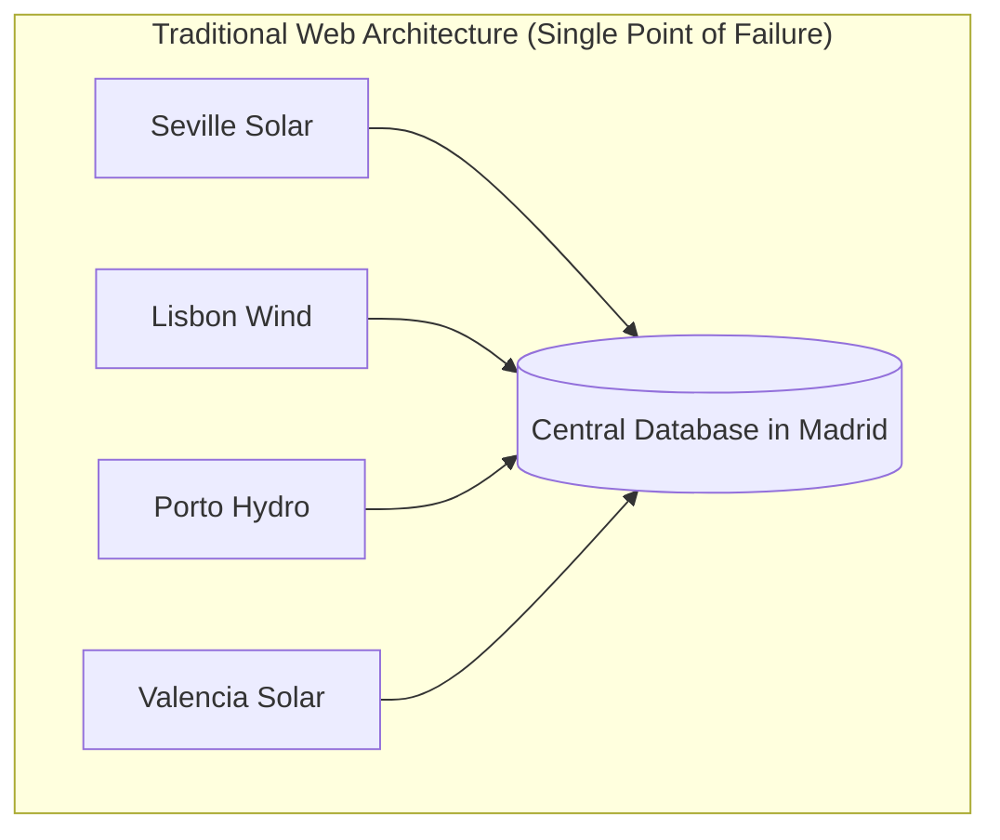
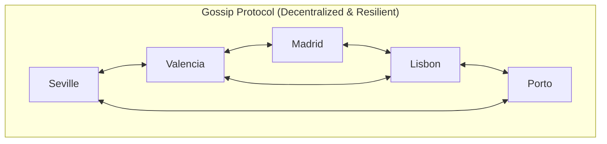
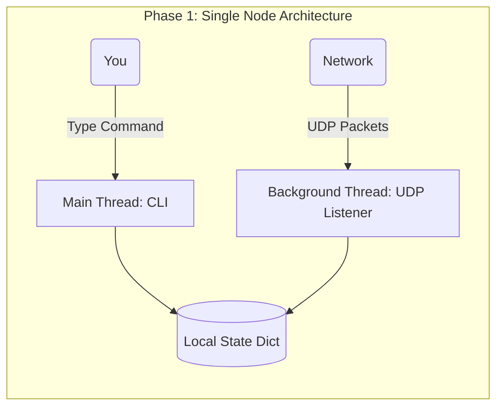
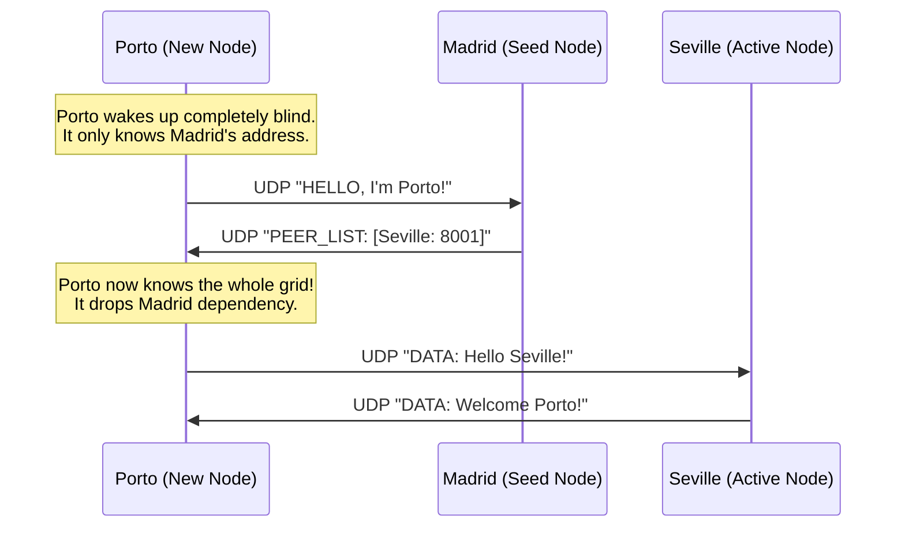
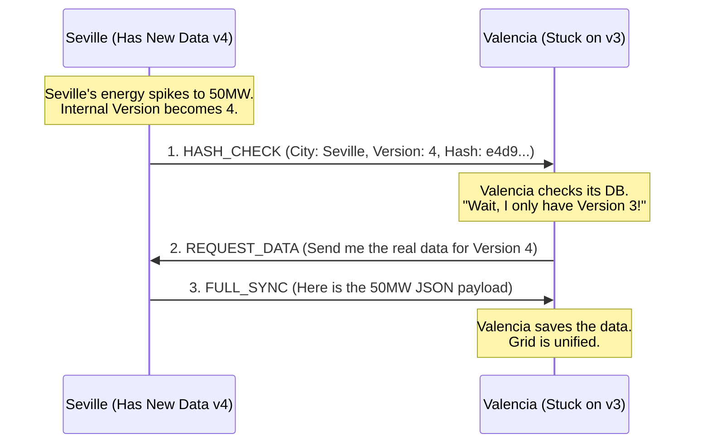
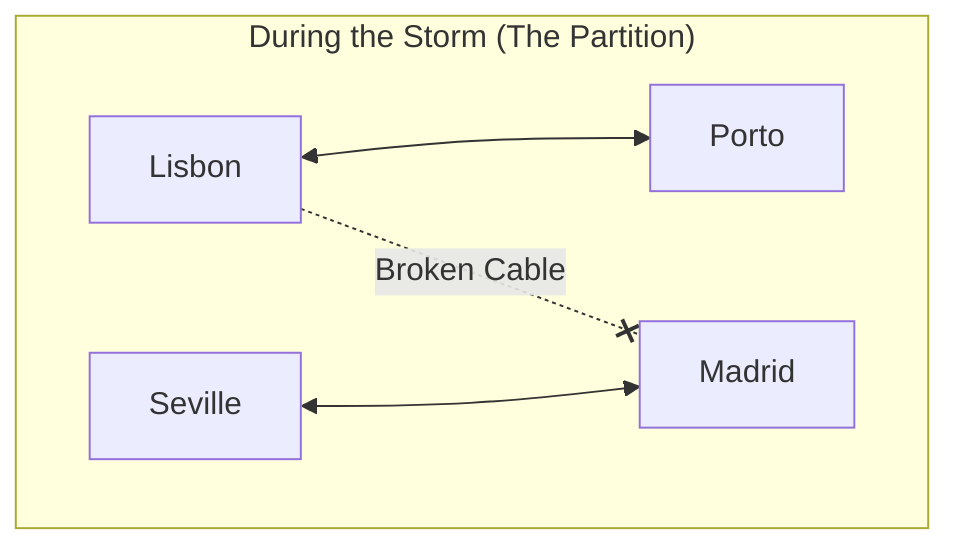
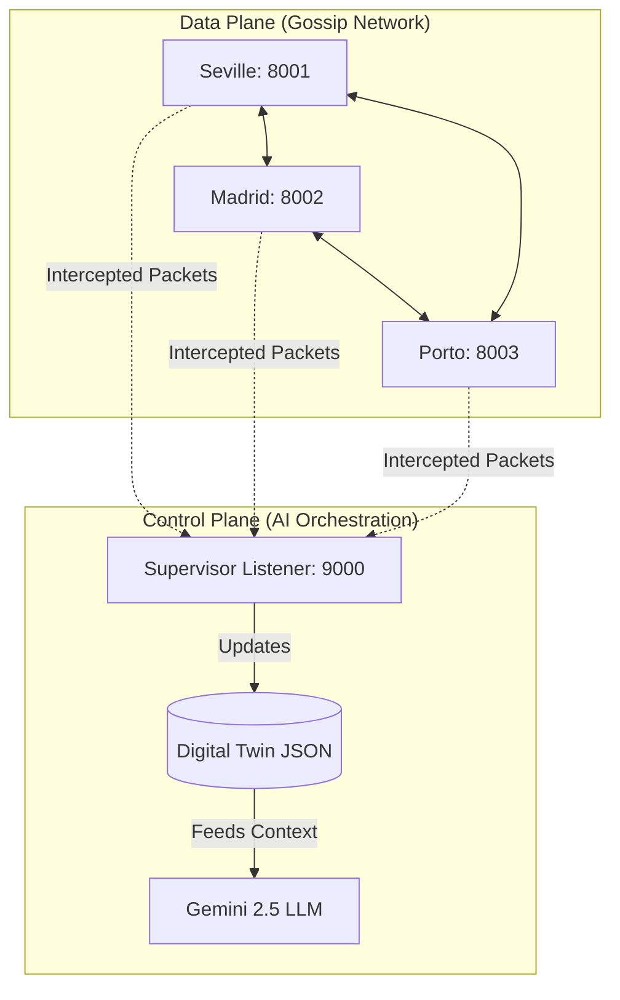

# 🌐 Masterclass: The Iberian Gossip-Protocol Grid

Welcome to the ultimate guide on building distributed systems. This isn't about setting up a web framework or calling an API. This is about raw, low-level computer science. 

You are going to build a **Decentralized Energy Market Simulator** spanning the Iberian Peninsula (Spain & Portugal).

Instead of a traditional central database, we will use a **Gossip Protocol**—the exact same peer-to-peer networking architecture that powers Apache Cassandra, Amazon DynamoDB global tables, and blockchain networks.

---

## 🏛️ Traditional Architecture vs. Gossip Architecture

### The Centralized Problem
In standard web development, everything revolves around a central database. 

If the central database in Madrid catches fire, the entire Iberian grid goes dark. None of the cities can talk to each other.

### The Gossip Solution
In a Gossip Protocol, there is no boss. Every node is an equal peer. If Seville generates excess energy, it randomly connects to a neighbor, whispers the data, and disconnects. That neighbor whispers it to two others. Within milliseconds, the information "infects" the entire network like a rumor.

If Madrid catches fire, Seville just routes its data through Porto instead. The system is functionally immortal.

---

## 🛠️ Phase 1: The Foundation (Single Node)

**File:** `node.py`

Before nodes can talk, we have to build a node. A node is an independent, self-contained Python process that maintains its own internal database ("state") and listens for incoming messages.

### Key Concepts

1. **UDP Sockets (The Walkie-Talkie):**
   Most web APIs use **TCP** (HTTP). TCP is like certified mail—you send it, the server signs for it, and sends a receipt back. It's safe, but slow because of the "handshake".
   We use **UDP**. UDP is like an open mailbox at the end of your driveway. You just drive by and throw a postcard (data) into it. We don't ask for permission. We don't wait for a receipt. It is incredibly fast and perfect for rapid-fire gossip.

2. **Ports (The Street Address):**
   Your computer is an apartment building (`127.0.0.1`). The port is the apartment number. Seville lives in apartment `8001`. Madrid lives in `8002`. 

3. **Threading (The Background Worker):**
   If you are writing a postcard, you can't simultaneously stand at the mailbox waiting for mail. So, we hire a background worker (a Thread) whose *only* job is to listen to the network, leaving the main program free to accept your commands.

---

## 🗺️ Phase 2: Node Discovery (The "Seed" Problem)

**File:** `seed_node.py`

### The Problem
If a new wind turbine boots up in Porto, it has no idea that Seville or Madrid even exist. We need a way for nodes to discover each other without relying on a central database.

### The Solution: Geographic Redundancy and Seed Nodes
We designate a small number of highly stable nodes as "Seeds". In our grid, we pick 3 anchors:
- **Madrid** (The Core)
- **Lisbon** (The Western Anchor)
- **Barcelona** (The Eastern Anchor)

If Madrid crashes 10 seconds later, the grid doesn't care. Porto is already connected directly to Seville. We have eliminated the Single Point of Failure.

---

## 🦠 Phase 3: The Infection (State Reconciliation)

**File:** `advanced_node.py`

### The Problem
If every node constantly yelled its entire database at everyone else, the network would crash from the traffic. We need them to sync their energy states, but they have to be incredibly efficient.

### The Solution: Anti-Entropy Sync
Nodes do not send data. They send **mathematical fingerprints** of their data using Cryptographic Hashing (MD5/SHA-256) and Version Vectors.

1. **Version Numbers:** Every time Seville generates power, its version ticks up (v1, v2, v3).
2. **The Hash:** We take `City + Energy + Timestamp + Version` and run it through MD5. It creates a string like `e4d909c2...`. If a single byte of data changes, the entire hash changes.

### The 3-Step Dance
When Seville connects to Valencia, it performs a surgical 3-step synchronization dance:

If Valencia already had Version 4, it would just ignore the `HASH_CHECK` and disconnect instantly. The network stays completely quiet unless there is an actual energy change.

---

## 🌪️ Phase 4: Chaos Engineering & The Split-Brain

### The Scenario
A massive storm cuts the internet lines crossing the border between Spain and Portugal. 
- Portugal can still talk to Portugal.
- Spain can still talk to Spain.
- But Spain cannot talk to Portugal.

### The Danger: Split-Brain
If Porto updates its energy to 999MW, the Portuguese nodes log it. But the Spanish nodes have no idea. The two halves of the grid have drifted apart. Spain thinks total capacity is X; Portugal thinks it is Y.

### The Architectural Fix: Eventual Consistency
In traditional web dev, if the DB splits, the app goes down. In distributed systems, we *embrace the partition*. We let both sides keep working independently. 

**The Healing:**
Hours later, the cable is repaired. A node in Lisbon finally reaches a node in Madrid.
1. Lisbon sends a `HASH_CHECK` for Porto.
2. Madrid realizes its Porto data is vastly out of date.
3. Madrid aggressively pulls the `FULL_SYNC` missing data.
4. Madrid then gossips this new data to Seville.

Within milliseconds of the cable being repaired, the entire peninsula is unified again without a single human having to restart a server.

---

## 🧠 Bonus Phase: The AI Supervisor (Control Plane)

**File:** `supervisor.py`

Our nodes (the **Data Plane**) are incredibly resilient, but they are "dumb". They only care about keeping the database consistent. They don't know *why* power is fluctuating.

We introduce a **Control Plane**: an AI Supervisor sitting above the network.

### How it works
1. **The Listener:** The Supervisor script binds to a port and passively listens to the UDP packets flying around.
2. **The Digital Twin:** It builds a real-time JSON representation of the entire Iberian grid in its memory.
3. **The AI Brain:** Every 15 seconds, it feeds this Digital Twin into the **Google Gemini LLM**, acting as the strategic overseer.

### The Result
The Supervisor detects that Seville spiked to 50MW, analyzes the surrounding grid, and outputs a real-time, AI-generated Situation Report (SITREP) advising human operators on how to route the power. You have successfully merged low-level distributed systems engineering with modern Agentic AI!
